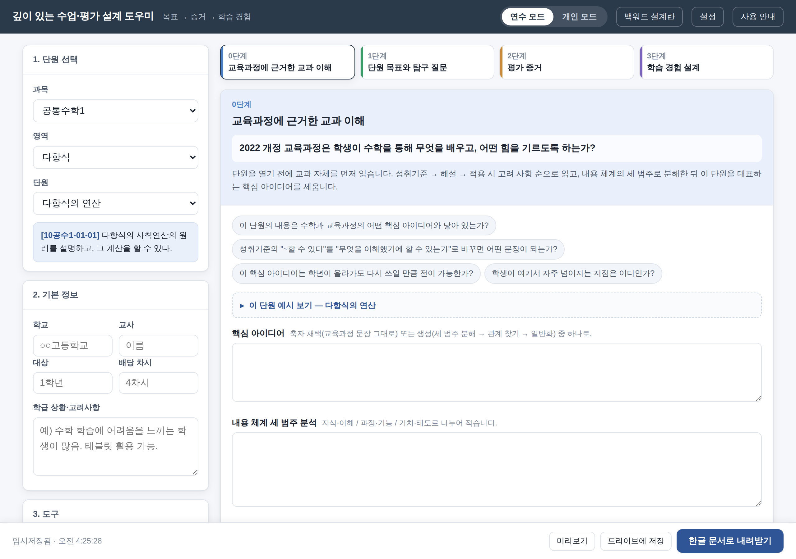
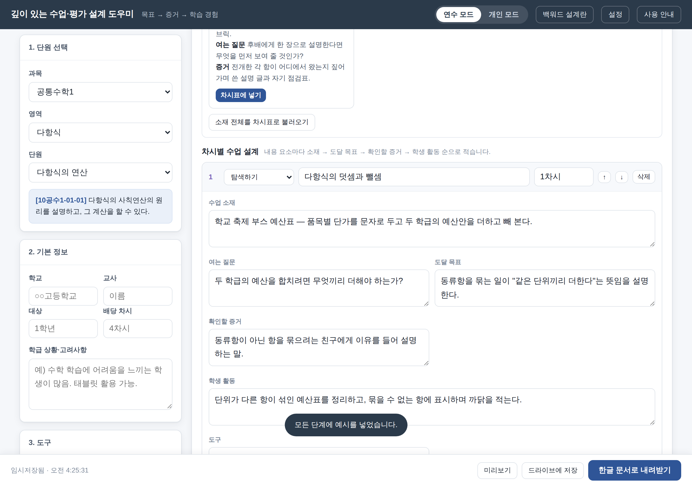
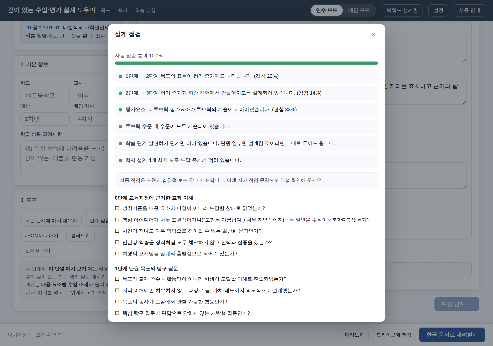
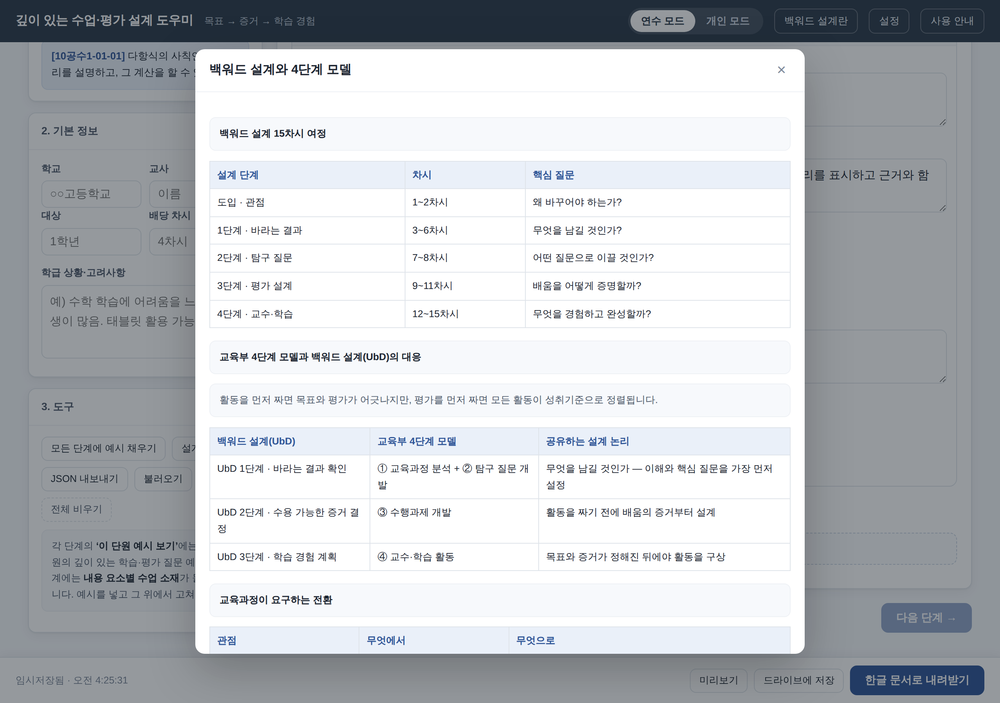

# 깊이 있는 수업·평가 설계 도우미

2022 개정 교육과정의 **백워드 설계**를 교실의 언어로 옮긴 Google Apps Script 웹앱입니다.
활동이 아니라 **목표 → 증거 → 학습 경험**의 순서로 단원을 설계하도록 화면이 안내하고,
완성된 설계안을 **한글 문서(.hwpx)** 로 바로 내려받습니다.

「2026 전북형 깊이 있는 수업·평가 · 백워드 설계」 교사 역량 강화 연수(15차시)의 산출물
— 핵심 아이디어, 탐구 질문 체계, 핵심 평가요소와 루브릭, 발견–탐색–적용–수행의 학습 경험 —
을 그대로 담도록 만들었습니다.

공통수학1·2 **18개 단원 · 성취기준 38개 · 내용 요소 72개** 분량의 단원별 예시가 들어 있습니다.

<p align="center">
  
</p>

---

## 설계의 순서

| 단계 | 생각해볼 질문 | 연수 단계 ↔ 교육부 4단계 모델 |
|---|---|---|
| **0단계** 교육과정에 근거한 교과 이해 | 2022 개정 교육과정은 학생이 수학을 통해 무엇을 배우고, 어떤 힘을 기르도록 하는가? | 1단계 바라는 결과(3~4차시) ↔ ① 교육과정 분석 |
| **1단계** 단원 목표와 탐구 질문 | 그렇다면 이 단원에서 학생은 무엇을 이해하고, 스스로 무엇을 할 수 있어야 하는가? | 1단계(5~6차시) + 2단계(7~8차시) ↔ ② 탐구 질문 개발 |
| **2단계** 평가 증거 | 학생의 어떤 풀이·설명·탐구에서 그 이해와 역량을 확인할 것인가? | 3단계 평가 설계(9~11차시) ↔ ③ 수행과제 개발 |
| **3단계** 학습 경험 설계 | 그런 이해와 역량을 기르도록 어떤 문제·탐구·토론을 설계할 것인가? | 4단계 교수·학습(12~15차시) ↔ ④ 수업 계획 |

---

## 무엇을 할 수 있나

**단원을 고르면 성취기준이 뜨고, 네 단계를 차례로 채웁니다.**
각 단계에는 사고를 여는 공통 발문, 그 단원 전용 예시, 자가 점검 문항이 함께 붙어 있습니다.
0단계는 내용 체계 세 범주 분석과 학생 오개념까지, 1단계는 핵심 탐구 질문과 탐구(안내) 질문
5~7개까지, 2단계는 핵심 평가요소·수행과제·4수준 분석적 루브릭까지 담습니다.

**내용 요소별 수업 소재가 들어 있습니다.**
3단계에서 단원마다 4개의 소재 카드를 제공합니다. 카드를 누르면 차시별 설계표에
`학습 단계 · 내용 요소 · 차시 · 수업 소재 · 여는 질문 · 도달 목표 · 확인할 증거 · 학생 활동 · 도구`가
채워지고, 그 위에서 고쳐 쓰면 됩니다. 소재는 **발견하기 → 탐색하기 → 적용하기 → 수행 및 성찰**의
네 단계를 모두 덮도록 구성했습니다.

> 예) *항등식과 나머지정리* — **탐색하기**: 같은 문제를 "직접 나눗셈 조"와 "대입만 하는 조"로 나누어
> 동시에 풀고 결과를 맞춰 보는 대결 · 여는 질문: "나누지 않고도 나머지를 알 수 있다면,
> 우리는 나눗셈에서 무엇을 본 것인가?"

<p align="center">
  
</p>

**오개념과 처치 발문이 짝으로 들어 있습니다.**
학생이 실제로 하는 말("값 세 개를 넣어 봤는데 다 맞으니 항등식이에요")과,
그 말을 흔드는 교사의 한 문장("세 점을 지나는 이차식은 몇 개인가?")을 함께 제공합니다.

**AI 초안은 자동·붙여넣기 두 가지로 쓸 수 있습니다.**
Gemini API 키가 있으면 바로 생성하고, 없으면 프롬프트를 복사해 원하는 AI에 붙여 넣은 뒤
결과를 가져옵니다. 프롬프트에는 **앞 단계에서 교사가 쓴 내용**과 그 단계의 자가 점검 기준이
함께 들어가 0→1→2→3의 일관성이 유지됩니다. 차시별 소재도 표 형태로 제안받을 수 있습니다.

**설계 점검이 정렬(Alignment)을 확인해 줍니다.**
1단계 목표가 2단계 증거에, 2단계 증거가 3단계 활동에, 평가요소가 루브릭에 실제로 이어졌는지
살펴보고, 루브릭의 네 수준과 학습 단계 네 구간이 모두 나타나는지 확인합니다.

<p align="center">
  
</p>

**연수 내용을 화면 안에서 다시 볼 수 있습니다.**
15차시 로드맵, UbD ↔ 교육부 4단계 대응, 좋은 핵심 질문의 5가지 조건, 질문 3유형,
GRASPS 6요소, 루브릭 4수준, 학습 경험 4단계와 역순 배치 질문, 수업 나눔의 Glow & Grow,
자주 나타나는 오해와 총론 인용을 담았습니다.

<p align="center">
  
</p>

**결과물은 한글 문서로 나옵니다.**
표지 정보, 성취기준, 0~3단계 표, 차시별 수업 설계, 설계 점검 결과, 자가 점검 체크리스트가
담긴 `.hwpx` 파일을 만듭니다([샘플](docs/samples/샘플_설계안.hwpx)).
외부 라이브러리 없이 Apps Script 안에서 직접 만들며, 한글 2014 이상에서 바로 열립니다.

그 밖에 **연수 모드 / 개인 모드** 전환, 자동 임시저장, JSON 내보내기·불러오기를 지원합니다.

---

## 배포 방법 고르기

같은 소스로 두 가지 배포가 가능합니다.

| | **Google Apps Script** | **Vercel** |
|---|---|---|
| 배포 절차 | 파일 붙여넣기 또는 clasp | GitHub 연결 후 자동 |
| 접근 제한 | 조직 내 사용자 등으로 제한 가능 | URL을 아는 누구나 (무료 플랜) |
| Gemini API 키 | 교사별로 구글 계정에 저장 | 교사별로 **브라우저에** 저장 |
| 한글 문서 내려받기 | 가능 (막히면 드라이브 저장으로 대체) | 가능 (제약 없음) |
| 드라이브에 저장 | 지원 | 미지원 (버튼이 숨겨집니다) |
| 비용 | 무료 | 무료 플랜으로 충분 |

학교·교육청 계정으로 **참여자를 제한**하려면 Apps Script,
**링크 하나로 누구나 바로 열게** 하려면 Vercel이 편합니다.

---

## 설치 ① — Vercel

1. 이 저장소를 GitHub에 올립니다.
2. [vercel.com](https://vercel.com) → **Add New → Project** → 저장소 선택
3. Framework Preset은 **Other**, Build/Output 설정은 **비워 둡니다**.
   (`vercel.json`이 이미 라우팅을 정의하고 있어 별도 설정이 필요 없습니다.)
4. **Deploy** → 나온 URL을 공유합니다.

API 키는 교사가 각자 웹앱의 **설정**에서 입력하며, 서버가 아니라 **그 브라우저에만** 저장됩니다.
요청할 때마다 함께 전달되어 Gemini로 중계될 뿐 저장되지 않습니다.

> 학교 공용 키 하나로 운영하려면 Vercel 프로젝트의 Environment Variables에
> `GEMINI_API_KEY`(필요하면 `GEMINI_MODEL`)를 추가하면 됩니다. 이 경우 URL을 아는
> 누구나 쓰게 되어 비용이 배포자에게 청구되니 권하지 않습니다.

---

## 설치 ② — Google Apps Script

### 방법 1 — 편집기에 붙여넣기 (가장 간단)

1. [script.google.com](https://script.google.com) → **새 프로젝트**
2. `src/` 안의 파일을 같은 이름으로 만들어 붙여넣기
   - `.gs` 파일 8개: **＋ → 스크립트**
   - `.html` 파일 3개: **＋ → HTML** (이름은 확장자 없이 `Index`, `Style`, `Script`)
3. **배포 → 새 배포 → 웹 앱**
   - 실행 사용자: **웹 앱에 액세스하는 사용자**
   - 액세스 권한: 조직 내 사용자(또는 필요한 범위)

### 방법 2 — clasp

```bash
npm install -g @google/clasp
clasp login
clasp create --type webapp --title "깊이 있는 수업·평가 설계 도우미"
cp .clasp.json.example .clasp.json   # scriptId 를 채워 넣습니다
clasp push
clasp deploy
```

자세한 내용과 권한 설명은 [docs/deployment.md](docs/deployment.md)를 보세요.

---

## 개발

```bash
node tools/dev-server.js    # http://localhost:8080 에서 웹앱을 그대로 열어 봄
node tools/verify.js        # 구문·데이터·문서 생성·프롬프트 점검
```

`dev-server.js`는 Vercel 배포와 **같은 코드 경로**(`lib/gas-runtime.js`)를 쓰므로,
여기서 보이는 화면이 Vercel에 올라갈 화면과 같습니다. Apps Script에 올리지 않고도
화면과 서버 로직을 함께 시험할 수 있습니다. (드라이브 저장만 Apps Script 전용입니다.)

---

## 파일 구성

### 백엔드 `src/*.gs`

| 파일 | 역할 |
|---|---|
| `Code.gs` | 웹앱 진입점, 설정값, 단원 조회 |
| `Stages.gs` | 0~3단계 정의, 발문, 자가 점검, 참고 자료, 차시표 열 정의 |
| `UnitsCommonMath1.gs` | 공통수학1 10개 단원 |
| `UnitsCommonMath2.gs` | 공통수학2 8개 단원 |
| `Api.gs` | 화면이 부르는 API — 프롬프트·Gemini·정합성 점검·문서 생성 |
| `DocBuilder.gs` | 설계 내용 → 한글 문서 블록 |
| `Hwpx.gs` | OWPML 생성과 ZIP 라이터 |
| `HwpxTemplate.gs` | 서식이 정의된 빈 한글 문서 (수정 불필요) |

### 프론트엔드 `src/*.html`

| 파일 | 역할 |
|---|---|
| `Index.html` | 화면 구조 |
| `Style.html` | 스타일 |
| `Script.html` | 화면 로직 |

### Node 배포 `api/` · `lib/`

Apps Script에만 올린다면 이 두 폴더는 없어도 됩니다.

| 파일 | 역할 |
|---|---|
| `api/index.js` | Vercel 서버리스 진입점 — 화면 렌더와 API 중계 |
| `lib/gas-runtime.js` | Node에서 `src/*.gs`를 그대로 실행하는 런타임 (Utilities 등 흉내내기, Gemini 호출) |
| `vercel.json` | 라우팅과 함수 설정 |

### 도구 `tools/`

| 파일 | 역할 |
|---|---|
| `dev-server.js` | 로컬 개발 서버 (Vercel 배포와 같은 경로로 동작) |
| `verify.js` | 배포 전 점검 (GitHub Actions에서도 실행) |

---

## 다른 과목·학년으로 확장하기

`src/UnitsCommonMath1.gs`의 항목을 복사해 고치면 화면·문서·AI 프롬프트에 자동으로 반영됩니다.
단원 하나의 구조와 필드별 작성 요령은 [docs/data-guide.md](docs/data-guide.md)에 정리해 두었습니다.

---

## 한글 문서 생성 방식

1. `HwpxTemplate.gs`에 담긴 빈 한글 문서(서식 포함)를 `ungzip → unzip`
2. 본문 `Contents/section0.xml`만 설계 내용으로 새로 생성
3. `mimetype`을 맨 앞에 무압축으로 두는 **자체 ZIP 라이터**로 다시 묶음

`Utilities.zip`을 쓰지 않는 이유는 mimetype이 압축되면 한글이 파일을 인식하지 못할 수 있기 때문입니다.

---

## 만든 사람

**2026 전북형 깊이 있는 수업·평가 설계 연수**
설계 도구 제작 — 인월고등학교 유경현

연수 자료(PPT·워크북)는 별도로 제작된 것이며, 이 저장소는 그 연수에 쓰는
설계 도구(웹앱)의 소스입니다.

화면과 한글 문서에 들어가는 제작 표기는 `src/Code.gs` 의 `APP_CREDIT` 세 줄에서
한 번에 고칠 수 있습니다.

```js
var APP_CREDIT = {
  training: '2026 전북형 깊이 있는 수업·평가 설계 연수',
  author:   '설계 도구 제작  인월고등학교 유경현',
  doc:      '2026 전북형 깊이 있는 수업·평가 설계 연수 · 설계 도구 제작 인월고등학교 유경현'
};
```

---

## 라이선스

MIT — [LICENSE](LICENSE)

단원 예시와 수업 소재는 2022 개정 교육과정 문서와 위 연수 자료를 바탕으로 작성한 것으로,
학교 현장에서 자유롭게 고쳐 쓰실 수 있습니다.
